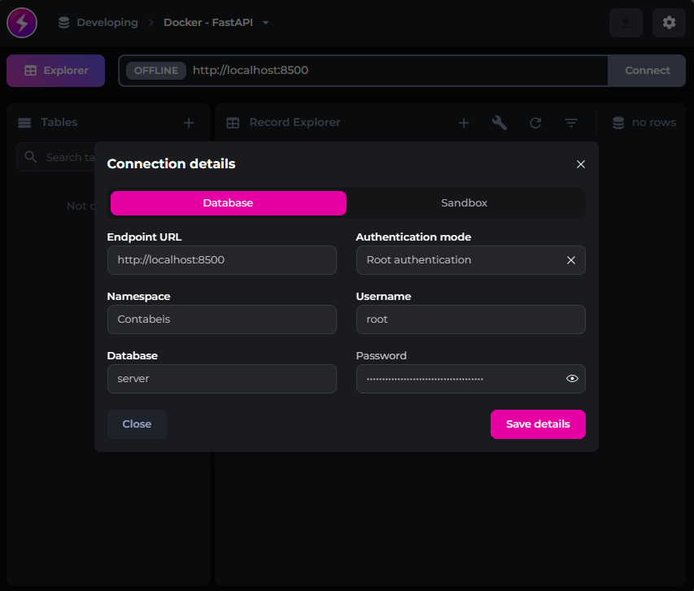
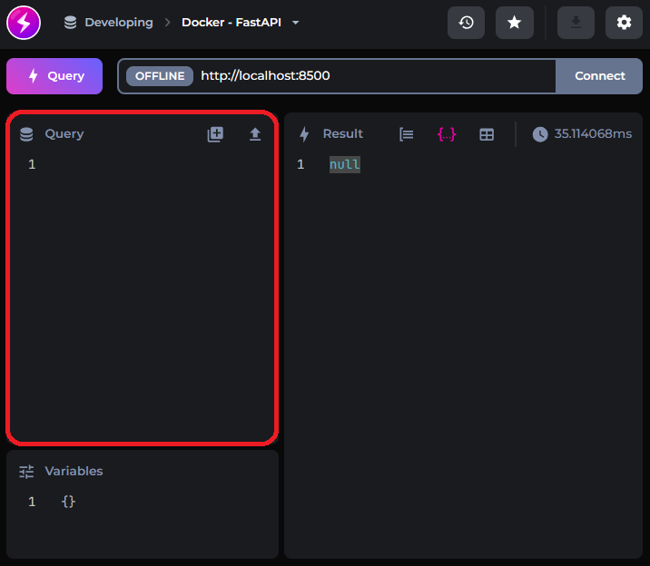

<div align="center">

# TCC - Lucchesi

</div>

Este repositório tem o objetivo único de demonstrar quais são os passos necessários para executar o meu TCC com a intenção de testar o desempenho da API escrita em Rust em diferentes hardwares.

<br/>

## Sumário

- [TCC - Lucchesi](#tcc---lucchesi)
  - [Sumário](#sumário)
  - [Clonando o respositório](#clonando-o-respositório)
  - [RustAPI](#rustapi)
  - [PythonAPI](#pythonapi)
- [Configurando o Banco](#configurando-o-banco)
  - [Conexão](#conexão)
  - [Registros Iniciais](#registros-iniciais)
    - [Usuário](#usuário)
    - [Último Web Scraping](#último-web-scraping)
- [Carregando os dados](#carregando-os-dados)
  - [Coletando os dados](#coletando-os-dados)
  - [Enviando ao Rust](#enviando-ao-rust)
- [Benchmark](#benchmark)

<br/>
<br/>

## Clonando o respositório

Antes de mais nada é necessário clonar este projeto para você ter os arquivos do `docker-compose` em sua máquina juntamente com os arquivos `.env` que serão necessários para executar os comandos docker.

```bash
git clone https://github.com/ViniciusLucchesi/tcc-lucchesi.git
```


## RustAPI

Com o repositório já clonado em sua máquina será necessário entrar na pasta `RustAPI` e executar o comando do `docker-compose` como demonstrado abaixo. 

```bash
cd RustAPI
```

```bash
docker compose -f rust.yaml up
```

<br/>

## PythonAPI

Os mesmos passos devem ser realizados para executar a aplicação do FastAPI, primeiro entre no diretório `PythonAPI` em seguida rode o comando docker.

```bash
cd PythonAPI
```

```bash
docker compose -f python.yaml up 
```

<br/>

# Configurando o Banco

Para ser possível utilizar as rotas que realizam a coleta e salvamento das informações em ambos os bancos de dados será necessário salvar algumas informações no banco de dados da API escrita em Python.


## Conexão

Acesse a interface do SurrealDB através do site [surrealist.app](https://surrealist.app/), com ele podemos clicar na barra superior (onde está escrito `OFFLINE`) para abrir as configurações de conexão. Dessa forma será necessário preencher os campos conforme o arquivo `.env` localizado na pasta `PythonAPI` como mostra a figura abaixo:



Após todos os campos estarem preenchidos clique em `Save details` e então pressione o botão `Connect`, caso a conexão não seja iniciada automaticamente.

## Registros Iniciais

Minhas rotas precisam de alguns parâmetros iniciais para funcionarem, como autenticação de usuário e dados referentes a última atualização do scraping.

Portanto deverão ser inseridos os dois registros abaixo no SurrealDB através do Surrealist no local destacado em vermelho, demostrado na imagem abaixo:



### Usuário

```sql
CREATE service:TipiAPI SET
    name = "TipiAPI",
    description = "A FastAPI application used to extract the XLSX file from website using web scraping",
    expiration = time::now() + 30d,
    active = <future> { time::now() < expiration },
    password = crypto::argon2::generate("123456");
```

### Último Web Scraping

```sql
CREATE scraper:info SET
    xlsx = "https://www.gov.br/receitafederal/pt-br/acesso-a-informacao/legislacao/documentos-e-arquivos/tipi.xlsx",
    by = "https://www.gov.br/receitafederal/pt-br/author/Subsecretaria de Tributação e Contencioso",
    date = "17/06/2023 01h19"
```

Cole ambos os comandos na área demarcada em vermelho na imagem anterior e pressione o atalho `Cntrl + Enter` para executa-los.

<br/>

# Carregando os dados

Agora que os parâmetros iniciais já foram carregados é hora de executar algumas rotas para preenchermos ambos os bancos dedados de nossas API's.

Para a execução das rotas você pode utilizar qualquer ferramenta que realize requisições HTTP, os exemplos a diante utilização o ThunderClient (extensão do Visual Studio Code), mas sinta-se a vontade para escolher a que mais lhe agrada.

Abaixo eu estou listando as rotas que deverão ser executadas e quais parâmetros devem ser passadas a cada uma delas.


## Coletando os dados

```text
GET -> http://localhost:7500/api/v1/tipi/upgrade

User: TipiAPI
pass: 123456
```

A rota acima é responsável por realizar o web scraping no site do governo, coletando o arquivo XLSX e extraindo seus valores para converte-los em formato JSON a fim de serem inseridos no SurrealDB.

## Enviando ao Rust

```text
GET -> http://localhost:7500/api/v1/scraper/data

User: TipiAPI
pass: 123456
```

Essa rota coleta todos os dados relacionados a tabela `tipi` no banco de dados da API escrita em Python e envia esses dados a API do Rust para que ela possa salva-los em seu banco, a fim de habilitar o envio dessa informação ao cliente final.


<br/>

# Benchmark

Para a realização do teste de performance será necessário instalar o software de benchmark chamado `oha` que pode ser encontrado [aqui](https://github.com/hatoo/oha).

Para rodar o teste em sí, basta executar o comando abaixo em seu terminal (lembrando que somente a API do Rust precisa estar rodando).

```bash
oha -n 10000 -T application/json -d '{"ncm":"0101.21.00"}' http://localhost:7000/v1/ncm/ --disable-keepalive
```
